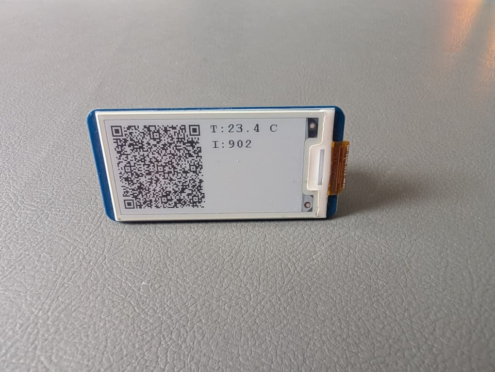
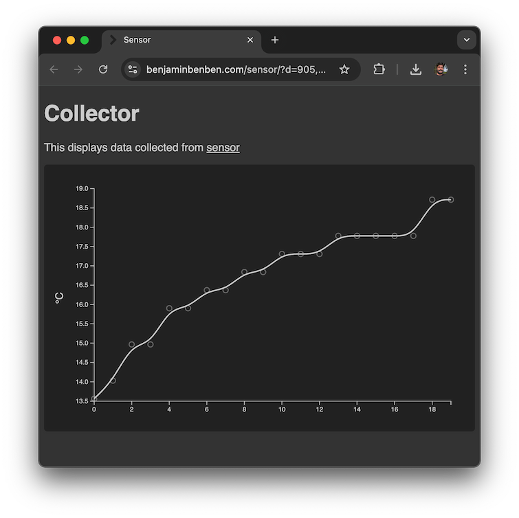

# Sensor

Share data from an offline device with QR Codes.

| Pico | Collector |
| --- | --- |
|  | 

## How it works

Data collected on a [Raspberry Pi Pico][pico] is displayed on an [eInk Display](waveshare) encoded as a QRCode.

> `https://benjaminbenben.com/sensor/?d=x,y,z…`

[pico]: (https://www.raspberrypi.com/products/raspberry-pi-pico/)
[waveshare]: https://www.waveshare.com/wiki/Pico-ePaper-2.13
